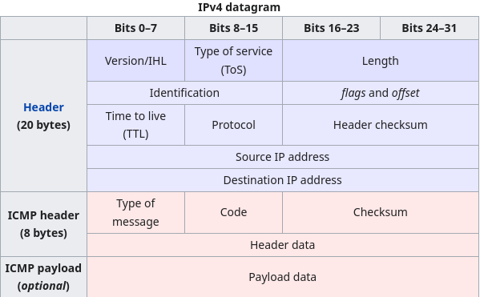

# ft_ping
Back on the grind. A 42 School project. the aim of the project is to emulate the ping command. The subject says: "Ping is the name of a command that allows you to test the accessibility of another machine through the IP network. The command also measures the time taken to receive a response, called the round-trip time."

Ping lavora al livello 3 del modello OSI


La comunicazione di ping è gestita grazie a un echo request seguito da un echo reply
echo request type = 8
reply = 0

l'utilizzo di telnet e nc vuol dire che stai utilizzando protocolli tcp/udp under the hood.
Quindi il mio obiettivo sarebbe quello di mandare un file con protocollo icmp quindi non dev'essere intercettato da telnet o nc

lavorare con rawbits
il bit è costruito così:
Tipo 8bit- Codice 8bit - checksum 16bit
        extended header 32bit
data_payload (size definita da utente)


l'icmp pare in grado di generare questi "quench messages" che servono a scartare i pacchetti che sono andati persi o hanno fallito in qualche modo

quindi quando avrai creato il pacchetto col protocollo corretto dovrai popolarlo seguento questo regolamento

## riguardo a ping

Ora mi concetrerò a tradurre l'indirizzo di dominio: questo lo deve fare il dns.
serve anche il reverse dns lookup per la stringa pazza

## Occhio bro 👀 💀

memset ha fatto una cosa orribile al codice, cerchiamo di riesumare l'accaduto. se provo a memsettare u valore della classe sockaddr_t usando il puntatore sbagliato, anzi ho capito, ho fatto un errore disattento:

ho fatto:

```c
memset(&packet->result, 0, sizeof(*packet->result));
//mi sono condannato ho over-sovrascritto la memoria, perché ho usato il *
//invece doveva essere
memset(&packet->result, 0, sizeof(packet->result));

```

## Parentesi sui Makefile praticamente un cheatsheet per crearne uno spiegato da Lollo per Lollo

Allora essendo che non tocco il basso livello da un po' di tempo mi sono ritrovato in questa situazione abbastanza normale direi che semplicemente non mi ricordo nullla.

Innanzitutto perché creare un mankefile invece che uno script in bash?
La risposta veloce: è più efficiente
La risposta effettiva: è più efficiente perché rispetto ad uno script in bash il  makefile prima di compilare controlla l'ultimo timestamp dei file, se sono avvenute modifiche e di conseguenza se dei file vanno ricompilati, cosa che con uno script in bash dovresti controllare manualmente. Tutal più questa cosa viene controllata dal makefile in automatico e risparmierebbe dei controlli che sarebbero da aggiungere allo script in bash.
I makefile hanno una struttura a dipendenza lavorano con i cosidetti **target** questi ultimi vengono realizzati tramite dei **prerequisiti** che sono anch'essi spesso dei target.

```makefile
COMPILING_RULES := gcc
PROGRAM_NAME := ft_ping
C_FILES := $(shell find srcs -name '*.c')
OBJS := $(C_FILES:srcs/%.c=objs/%.o)
FLAGS := -Wall -Wextra -Werror -g

GREEN := e[0;32m
RESET := e[0m
RED := e[1;31m

# objs folder rule creation without the -c the c files that don't have a main
# would go in an error the % is an expander it matches every file that has a .o or .c
# YOU HAVE to specify the folder or it would search in the same folder of the makefile
# $@ stands for the target literally "objs/%.o" and $< stands for the requisite "srcs/%.c

objs/%.o: srcs/%.c
	@echo "$(GREEN)file object compilation$(RESET)"
	@mkdir -p $(dir $@)OBJS
	$(COMPILING_RULES) $(FLAGS) -c $< -o $@


all: $(PROGRAM_NAME)

$(PROGRAM_NAME): $(OBJS)
	@echo "$(GREEN)program name rule$(RESET)"
	$(COMPILING_RULES) $(FLAGS) $(OBJS) -o $(PROGRAM_NAME)


clean:
	@echo "$(GREEN)cleaning directory of objs$(RESET)"
	rm -rf objs


fclean: clean
	@echo "$(GREEN)removing every file created by Makefile$(RESET)"
	rm -f $(PROGRAM_NAME)

re: fclean all

.PHONY: all clean fclean re
```

Pare un casino, se non sai le regole infatti sono qui per fare da mini reminder di alcune regole chiave che fanno funzionare questo makefile in maniera pulita e sensata.
Allora nelle prime righe semplicemente c'è la dichiarazione delle variabili, bisogna fare particolarmente attenzione alle variabili che come contenuto possiedono dei valori elaborati tra parentesi. Queste io le chiamo _operazioni implicite_, in soldoni il risultato delle operazioni che stanno avvenendo tra parentesi andranno nella variabile.
Le due operazioni sono completamente diverse, e vi spiego il perché quella che avviene nella variabile C_FILES è praticamente la ricerca tramite bash di file .c infatti una cosa sorprendente è il fatto che il linguaggio make possiede della parole chiave per fare azioni speciali, nel caso mio mi serviva il risultato di un comando in bash e allora ho utilizzato la parola chiave **shell** per dire al makefile che la stringa dopo la parola chiave era un comando.

Nel caso dei file oggetto, c'è un po' di ragionamento in più diciamo che stiamo creando una variabile basandoci su di una sostituzione, infatti objs sta dicendo di essere praticamente come C_FILES però si trovano nella cartella objs e finiscono con .o un po' strano lo so ma funziona così. La cosa interessante è che questa "sostituzione" è coerente perché inserisce la stringa objs/nome_file.o dentro OBJS ma questi file non esistono ancora, infatti è solo una stringa, come vogliamo creare la variabile OBJS. infatti se vedi dopo nel makefile ci concentriamo prima a creare i file oggetto nella rispettiva cartella, e già da qui si realizza la dichiarazione di OBJS che quando verrà utillizzato, dopo la creazione dei file oggetto, funzionerà. Se i file oggetto non venissero creati prima di usare OBJS il makefile farebbe cilecca.
uff tosta eh ma non sconcetrarti adesso. Quindi ricorda: Le variabili sono stringhe finché non vengono invocate dei target

Comunque per darti un'idea una regola in makefile è strutturata così
Target: requisito
	regole per creare target $(requisito)

Ci sono delle piccolezze da ricordarsi quando si fa un makefile
1. Il makefile se viene invocato normalmente, quindi solo make, andrà dall'alto verso il basso eseguendo le regole target in ordine
2. Se una regola ha bisogno di un requisito il makefile salterà nella regola target che creerebbe il requisito della regola precedente

quindi nel nostro esempio sopra la prima regola che verrà eseguita è quella per creare i file oggetto. quella regola però a bisogno della cartella "srcs/%.c" che in italiano significa: ho bisogno che da dove eseguo il makefile sia presente la cartella srcs e che al suo interno ci siano dei file c, se ci sono la regola utilizzerà i file c presenti in srcs.

la regola successiva per esempio all ha bisogno di PROGRAM_NAME per funzionare → PROGRAM_NAME ha bisogno dei file oggetto e così via abbiamo già spiegato come viene costruita la variabile OBJS

## shortcut o cose che non sembrano aver senso pt1

hai visto $@ $< rispettivamente uno rappresenta il target e l'altro il requisito
Quindi se io avessi
Target: requisito
	echo $@ $<

mi stamperebbe Target requisito. è comodo perché quando hai una wildcard %.c ti rappresenta come si deve ogni singolo file di interesse
per aiutarti ecco un mini esempio.
```bash
hey: one two
# Outputs "hey", since this is the target name
echo $@

# Outputs all prerequisites newer than the target
echo $?

# Outputs all prerequisites
echo $^

# Outputs the first prerequisite
echo $< touch hey one: touch one two: touch two clean: rm -f hey one two
```

.PHONY viene usato semplicemente perché così eviti di utilizzare parole chiave che potrebbero essere usate dal terminale.

## Fonti

[guida alla creazione di un makefile](https://makefiletutorial.com)

[Algoritmo del checksum](https://datatracker.ietf.org/doc/html/rfc1071#autoid-3)
[rfc di ping](https://datatracker.ietf.org/doc/html/rfc792#ref-1)
[challenge e introduzione ad un approccio per ping](https://medium.com/@gapple.web3/from-zero-to-ping-how-i-rebuilt-the-classic-network-tool-in-c-5f9ce447a291)

### Libraries

wenet.h
sockaddress.h ecc

network -> big endian
our_machine -> little endian
h_to_h

tokenizer per le flag getopt (funzione) per le opzioni di ping
parsing solo -v e -h

getpopts -> per le flag lunghe
flag? -> vuol dire che ha un argomento dopo la flag
hmp

time to live [bonus] è una flag.
Eval sheet -> time to live basso

## Obiettivi

* prima simulazione del comando ping concentrarci sull'invio del messaggio quindi echo 8 e risposta echo 0
* gestione di raw sockets per sniffing di pacchetti

## struttura

famo mente locale dai andiamo di logica e vinceremo voglio capire cerco.... **LA VERITÀ**.

il mio main:

```c
typedef struct s_raw_socket_sniffer_packet
{
	//--------- Special types ---------
	struct sockaddr			saddr;
	struct sockaddr_in		source, dest; // they are meant to be used to get the ip
	struct ethhdr			*eth; //this IS the ethernet header NOT USEFUL FOR THIS PROJECT
	struct iphdr			*ip; //this is used to get the ip header
	//---------------------------------

	int						sock_r;
	unsigned char			*buffer; // for ethernet header
	ssize_t					buflen;
	char					*dns;
} t_raw_socket_sniffer_packet;
```

questa struttura infame, abbiamo anche addrinfo che serve per il provider? Ma fino a che punto?

### la risoluzione del dns e il reverse dns

so che tutto gira intorno a getaddrinfo una funzione molto potente in grado di risolvere l'indirizzo ip del mittente avendo solo il nome di quest'ultimo.
il prototipo ha questo aspetto

```c
int getaddrinfo(const char *nodename,
                const char *servname,
                const struct addrinfo *hints,
                struct addrinfo **res);
```

da quel che sono riuscito a capire, questa funzione è fondamentale per il dns, come sono fondamentali i due attributi della struct addrinfo, cioè hints e res. Andiamo in ordine però, hints pare avere tutti i dati necessari per getaddrinfo per capire con quali pacchetti lavoriamo, questo per riuscire in ordire a reperire l'ip giusto in base alle circostanze, nel nostro caso io ho inizializzato hints per gestire pacchetti ICMP

```c
hints.ai_family = AF_INET;
hints.ai_socktype = SOCK_RAW;
hints.ai_protocol = IPPROTO_ICMP;
```

un dubbio che rimane è dove e come stampare il risultato dell'operazione di
questo converte solamente un testo però.... ora devo trovare il modo di convertire dato un ip
visto che a noi serve in FQDN, che sarebbe una stringa più articolata in grado.

Si parla anche di questo attributi AI_FAMILY, questo attributo simboleggia si la famiglia del socket ma anche **che socket** nello specifico **filtrare** da accettare, con AF_INET accettiamo solo ip ipv4 quindi la funzione non proverà a reperire ip della famiglia ipv6, interessante.

abbiamo dei pezzi che non tornano ancora:
inet_ptoa() funzionerebbe da checker per un ip valido, insomma era da utilizzare per capire se la stringa passata da terminale era già un ip da contattare. PERÒ getaddrinfo fa tutto il lavoro e non serve nemmeno fare questo controllo visto che getaddrinfo sa già se fare o no il dns_lookup, potentissima.
prossima volta facciamo il reverse dns_lookup allora

per chiudere il dubbio di prima, utilizziamo la funzione inet_ntop -> network to presentation, questo permette ad un indirizzo apparentemente in binario di diventare leggibile, stringa/ascii.

## Il checksum del pacchetto


se ho capito bene, è l'ultimo tassello del pacchetto dopo che il pacchetto stesso è stato creato.
Voglio far notare a me stesso, che fino ad adesso ci siamo limitati solamente a capire chi fosse il destinatario, ma mai a capire come mandare un pacchetto ad esso, questo viene risolto grazie all'apposita struct icmphip o qualcosa del genere. Comunque il checksum è particolare perché sarebbe un'etichetta che ci fa capire se un pacchetto è valido o no. praticamente sta alla fine del pacchetto ed è la prima cosa che, viene letta dal destinatario.
Oppure è anche la prima cosa che leggiamo noi quando il destinatario ci risponde.

il nome non è casuale, infatti è il "controllo" della "somma".
Il checksum è contraddistinto dalla somma dei vari bits, o dei valori adiacenti in un buffer e dal cambio del risultato finale in una versione complementare.
Se abbiamo per esempio

1010
1100

la somma sarà
(1)0010

c'è un 1 di carry quindi secondo l'algoritmo del checksum va sommato al risultato attuale quindi
0010
---1
= 0011

ora prendiamo il valore **complementare** invertiamo 1 in 0 e  viceversa

1100
questo è il nostro checksum. a quanto pare questo si chiama "one's complement"
ok ho capito in binario, ma come diavolo lo rappresento in codice.

Nel nostro caso, non serve fasciarci tanto la testa, dobbiamo capire sopratutto che l'algoritmo, si basa sul contenuto del pacchetto stesso. Infatti il pacchetto determina il checksum stesso,
per essere più chiaro il checksum è la somma del pacchetto smolecolato in bytes e suddiviso in n gruppi di bit, questi bit vengono poi sommati tra loro creando il checksum.
Per verificarlo si prende il checksum e lo si somma al pacchetto, se esce tutto 1 il pacchetto è integro.

Esempio:
immaginiamo di avere un messaggio "ciao mondo" che diventa
01100011
01101001
01100001
01101111
00100000
01101101
01101111
01101110
01100100
01101111
00001010

= qualcosa
questo quantitativo basta sommarlo un poco alla volta per ottere il checksum.
una piccola idea per me, un programma che data una stringa composta da 1 o 0 mi dia il corrispettivo
esadecimale porco mondo.
Anche l'aritmetica esadecimale serve perché C non sa calcolare col binario a quanto pare o comunque facilita i calcoli? boh non sono così sicuro.

comunque l'algoritmo di invio da parte del pinger è così

```c
unsigned short	sender_checksum(void *package, int pckg_len)
{
	unsigned int sum=0; // 32 bit
	unsigned short result; // 16 bit
	unsigned short *buf = package; // 16 bit

	for (sum = 0; pckg_len > 1; pckg_len -= 2)
		sum += *buf++;

	if (pckg_len == 1)
		sum+= *(unsigned char*)buf;

	// qualsiasi valore carry viene shiftato a destra
	// e sommato al valore originale mascherato che toglie i vecchi carry
	sum = (sum >> 16) + (sum & 0xFFFF);
	sum += (sum >> 16);

	result = ~sum;
	return result;
}
```

fai attenzione❗ alle operazioni bitwise, questo perché l'algoritmo del rfc lavora con coppie di bytes quindi 16 bits, l'algoritmo di per se compie delle azioni prende gli 8 bit e li mette dentro uno storer da 16 così lavoriamo con 2 bytes, questo fa comodo al computer e il RFC è stato fatto per lavorare su singole CPU che ai tempi puntavano all'efficienza. lavorare un byte alla volta renderebbe più confusionario e doveroso il calcolo non sfruttando la potenza della CPU al suo massimo, ai tempi era in grado di gestire 16 bytes quindi perché non usarla al suo massimo?
ci sono anche più casistiche coperte:
8 bytes = massimo 256 possibilità di rilevare un checksum fallato
16 bytes = 65.536 combinazioni.

Invece se dobbiamo concentrarci solamente sul tradurre un checksum, se ne abbiamo accesso semplicemente,
ci basta prendere il checksum calcolato passarlo ad una funzione che essenzialmente farà la stessa procedurà, calcolando **IL SUO CHECKSUM**. L'unica vera differenza sarà alla fine dove, prima di fare lo shifting e quant'altro si sommerà al checksum ricevuto in input, se invertendo con la ~ uscirà 0 come risultato intero, allora il pacchetto sarà integro.

## Come costruire il pacchetto?

il pacchetto icmp della struttura icmp ha dei pezzi fondamentali (UPDATE)

```c
struct icmphdr icmp;
icmp->type = ICMP_ECHO;           // Echo Request
icmp->code = 0;                   // Always 0 for ping
icmp_header.un.echo.id = htons((uint16_t)getpid()); // Process ID it has 16 bit format getpid gives you a 32 bit ones keep it in mind 🧠
icmp->un.echo.sequence = seq++;   // Sequence number parte da 1 (non c'è scritto ma pare così)
icmp->checksum = calculate_checksum(icmp, packet_size);
char payload[56 bytes]
```

l'id è per tenere traccia del processo che sta facendo la request
la sequenza è solo un counter per gestire la quantità di pacchetti inviati (che siano ricevuti o meno)
il checksum lo sappiamo molto bene.

Ok il RFC pare bello particolare. Vediamo il rapporto con il protocollo in confronto a (🆗 = capito)
gateway ❌ non so su che rete lavori
checksum 🆗
datagram (com'è costruito il pacchetto) 🆗
inviare e ricevere 🆗

pare che il RFC dica di dire quando una destinazione non sia raggiungibile anche se ping si appende

fai attenzione alla conversione dell'id del pacchetto altrimenti rischi di giocartelo nel calcolo della checksum

## Socket programming l'abc delle funzioni (cheatsheet)

socket
read
sendto
listen
bind
poll/epoll -> peaking for recv/recvfrom? socket non-bloccante forse
recv
recvfrom (gemella di sendto bloccante)
inet_ntop -> da rivedere

## ricevere il dato (poll)

recvfrom è il metodo per capire se il pacchetto inviato sta lavorando a dovere, riceve in quantità, il numero di bytes con cui il nostro destinatario risponde,
però è una funzione **bloccante** questo significa che quando viene invocata, causa al programma di bloccarsi improvvisamente
fino a quando qualcosa non arriva.

il problema di questo fattore bloccante, è che praticamente se fallisse qualche interazione o ci fosse un timeout, non potremmo mai saperlo.
Questo perché a livello di funzionalità recvfrom al compito di ricevere, non a un timer interno
che gli permette di decidere **quanto tempo deve aspettare**.


## l'iceberg della conversione dei socket e inet_ntop che mi tradisce

allora, siamo arrivati indubbiamente a buon punto, il messaggio va, c'è un feedback, quindi no timeout, e ora ci basta capire se chi ha risposto è lo stesso con cui volevamo comunicare.
Una semplice stampa no? ahahahah col cavolo, grazie a recvfrom siamo in grado di mettere in un contenitore colui che risponde al nostro ping, il problema? usa un sockaddr e non un sockaddr_in, perché dev'essere generico e gestire più protocolli. una cosa interessante che però ho imparato è che sockaddr è come l'argilla, può essere plasmato per incastrarsi nel protocollo che più ti interessa

infatti una cosa del genere non è per niente impossibile castando al tipo che ci interessa

```c
ipv4_caster = (struct sockaddr_in *)sender;
```

ed è **l'unico modo** che ho trovato per ora per capire con chi stessi comunicando.
Ho fatto una piccola funzione apposita per gestire la risposta, o almeno per capire se il destinatario mi HA RISPOSTO

```c
void	print_msg_rec_data(struct sockaddr *sender, size_t package_size, int seq, t_dest_data destinatary)
{
	char	sender_ip[1024];
	struct sockaddr_in	*ipv4_caster;

	ipv4_caster = (struct sockaddr_in *)sender;

	strip_sender_ip(sender);
	if (sender)
	{
		memset(sender_ip, 0, sizeof(sender_ip));
		inet_ntop(AF_INET, &(ipv4_caster->sin_addr), sender_ip, INET_ADDRSTRLEN);
		if (strcmp(sender_ip, destinatary.dns_ip) == 0)
			printf("%zu bytes from %s: icmp_seq=%d\n", package_size, sender_ip, seq);
		else
			printf("someone %s is answering instead of the destinatary %s\n", sender_ip, destinatary.dns_ip);
	}
	else
		printf("The  address of the sender is not defined uknown answerer\n");

}
```
il metodo lacca ancora di qualcosa, i bytes di risposta sono incorretti.

ho appena scoperto che a sendto frega il cavolo se un pacchetto segue un protocollo? Damn non sapevo
cioè puoi mandare una struct con i suoi dati dentro e lui da solo la invia, ecco come si manda il payload. Per essere più chiari e concisi:

noi abbiamo la nostra struct

```c
typedef struct s_icmp_packet_to_send
{
	struct	icmphdr icmp_header;
	char	packet_content[PCKG_PING_S];
}t_icmp_packet_to_send;
```

il primo elemento "icmp_header" è l'header del pacchetto, serve a far capire al destinatario
**come vogliamo** comunicare con lui.
La seconda variabile "packet_content" è il payload, nel nostro caso dev'essere SEMPRE 64 bytes, altrimenti il pacchetto, non viene riconosciuto come pacchetto ICMP,

_cosa sbagliavo?_ semplicemente con sendto all'inizio mandavo solo l'header, e lui per miracolo mi rispondeva, questo perché il contenuto del payload è **facoltativo**.
Ma anche quando mandavo il payload i conti non tornavano mi tornava un pacchetto di 92 bytes?
da dove arrivano questi extra 28 bytes? In realtà la spiegazione è nel messaggio in se.
quando inviamo il pacchetto esso è composto da un payload (64 bytes) e l'header (8 bytes) che fa 72 bytes.
Questo è costruito da noi non si può sbagliare su di ciò.
quegli extra 20 bytes in realtà sono **l'header del protocollo ipv4**, che servono per capire come comunicare sulla rete, visto che siamo al livello 3, infatti se andiamo a vedere il pacchetto
ICMP nel dettaglio con setup ipv4



quindi si i conti tornano 64+8+20 = 92, se vogliamo **isolare** il payload dobbiamo sbarazzarci
dei due header purtroppo per noi è tutto salvato nel buffer che viene modificato in ricezione, quindi
ci sono 2 cose da fare:
1. castare il puntatore al buffer a ip e reperire in base al protocollo di rete (IPV4) la lunghezza del payload
2. castare nuovamente il puntatore al buffer **sommarla** alla lunghezza dell'header ipv4 per reperire la grandezza dell'header icmp.

infine facciamo una sottrazione della risposta con i due header, così abbiamo la grandezza del pacchetto finale. se la grandezza è uguale al numero di bytes inviati, il pacchetto è coerente.


## gestire gli errori come un pro in C

ziobon
